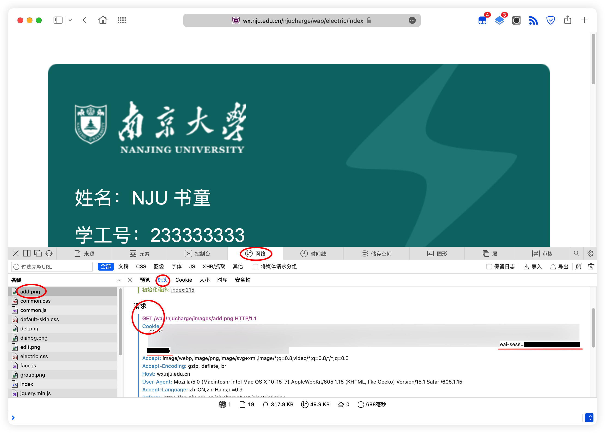

# NJU 书童

书童嘛，侍候你读书。

## 现在支持的功能

✅ 监测寝室电量，电量不足时执行脚本 `electric.sh`（再也不用担心寝室突然<del>失明</del>停电啦～）

✅ 每日健康打卡提醒，每天早上 10 点和晚上 10 点检查是否已打卡，如果没打卡就会提醒你

## 初次安装

1. 准备一台服务器，也可以是个人电脑或者机房电脑等，安装 Docker 和 Docker Compose
2. 在合适的位置 `mkdir nju-shutong && cd nju-shutong` 创建并进入文件夹
3. 下载应用程序配置 `curl https://raw.githubusercontent.com/chenghaopeng/NJU-ShuTong/master/docker-compose.yaml -o docker-compose.yaml`
4. 准备环境变量文件 `touch .env`
5. `mkdir scripts && vim ./scripts/message.sh`，创建脚本文件夹，并编辑信息提醒脚本，内容自定义。当书童需要提醒你的时候，会调用此脚本，并且会添加一个叫做 `CONTENT` 的环境变量，表示提醒的文本内容，可以在你的脚本中直接使用。例子：你可以在脚本中这么写 `curl --request POST https://mou.ge.wang.zhi/fasong/xiaoxi --header 'Content-Type: application/json' --data-raw "{\"content\":\"$CONTENT\"}"` 表示把 CONTENT 发送到某个特定网址，让它来后续处理，比如由它来将 CONTENT 在企业微信或者钉钉上发送给某人
6. 启动程序 `docker-compose up -d` 完成！

## 不是初次安装？

1. 按照现版本修改配置
2. 用下文《如何重启书童》中的 2 方法更新

## 各功能配置

### 寝室电量监测

1. 配置 EAI_SESS，见下文
2. 配置所监测的房间
   1. 访问 `https://wx.nju.edu.cn/njucharge/wap/electric/index`
   2. 选择你要监测的寝室
   3. 点击“去充值”，跳转到新的页面
   4. 网址是这种形式 `https://wx.nju.edu.cn/njucharge/wap/electric/charge?area_id=【校区编号】&area_name=【校区名称】&build_id=【楼栋编号】&build_name=【楼栋名称】&room_name=【房间名称】&room_id=【房间号】`
   5. 这里我们用到校区编号、楼栋编号和房间号
   6. `echo 'ROOM="【校区编号】,【楼栋编号】,【房间号】" >> .env'` 注意是英文逗号隔开。例子：`ROOM="01,gl43,0101"` 表示鼓楼陶三 101 房
3. 重启书童

### 每日健康打卡监测

1. 配置 MOD_AUTH_CAS，见下文
2. 重启书童

## 各种说明

### 如何配置 EAI_SESS

1. EAI_SESS 是你在访问信息门户时的“身份证”，有了这个，书童才能代替你去访问信息门户
2. 访问 `https://wx.nju.edu.cn/njucharge/wap/electric/index`
3. 在开发者工具中随便点开一个请求，在 Cookie 里就能找到这个字段 
4.  `echo "EAI_SESS=【你的 EAI_SESS】" >> .env` 将获取到的 EAI_SESS 存入配置

### 如何配置 MOD_AUTH_CAS

1. MOD_AUTH_CAS 是你在访问南京大学手机应用时的“身份证”，有了这个，书童才能代替你去访问手机应用
2. 访问 `https://qrcode.nju.edu.cn`
3. 类似《如何配置 EAI_SESS》中的方法，在所有请求中找到类型为 xhr 的任意一个请求，在它的 Cookie 中就可以找到 MOD_AUTH_CAS 字段了
4. `echo "MOD_AUTH_CAS=【你的 MOD_AUTH_CAS】" >> .env` 将获取到的 MOD_AUTH_CAS 存入配置

### 如何重启书童

1. `docker-compose restart` 这是仅重启，会使用最新的配置文件
2. `curl https://raw.githubusercontent.com/chenghaopeng/NJU-ShuTong/master/docker-compose.yaml -o docker-compose.yaml && docker-compose pull && docker-compose up -d` 这是完全更新并重启书童